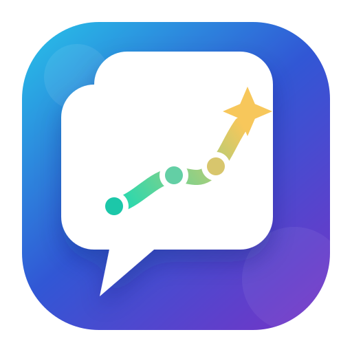
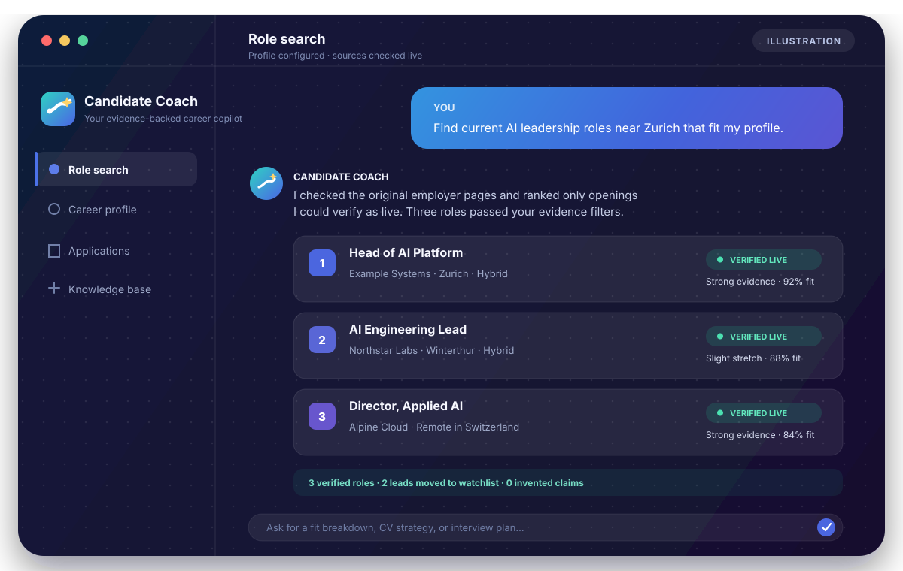
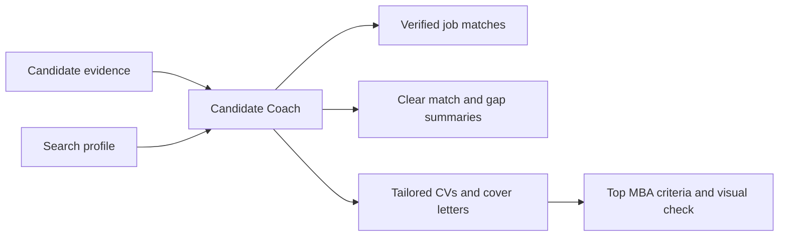

<p align="center">
  
</p>

<h1 align="center">Candidate Coach</h1>

<p align="center">
  An evidence-backed career copilot for Codex.<br>
  Find matching jobs and create truthful, polished applications.
</p>

<p align="center">
  <a href="LICENSE"></a>
  
  
</p>

Candidate Coach uses your own career evidence and search preferences to find suitable roles, explain the match honestly, and produce application documents you can confidently review and submit.

<p align="center">
  
</p>

> The conversation above is illustrative. Company names and fit scores are examples, not live recommendations.

## Main use cases

### Find jobs that match you

```text
Find jobs that match my profile.
```

Candidate Coach searches using both your career knowledge base and your configured search profile. Every job reported as a result is checked on the original employer page during the search. The title, location or work model, job description, and active application path must still be visible.

If a role cannot be verified as open, it is not presented as a result. It can appear separately as an unverified lead or watchlist item.

### Understand the match and gaps

```text
How well do I match this role? <job URL>
```

Each result comes with a short, practical assessment:

- the strongest evidence for the match;
- adjacent experience that transfers but is not identical;
- important missing evidence or qualification gaps;
- an overall verdict such as `appropriate` or `slight stretch`.

Candidate Coach never turns related experience into direct experience and does not invent credentials, impact, or motivation.

### Create a CV and cover letter

```text
Create a CV and cover letter for this role: <job URL>
```

Candidate Coach automatically builds a role-specific application strategy, applies the interview and positioning criteria distilled from the Top MBA framework, and creates truthful documents from your knowledge base.

Finished CVs and PDF cover letters use a restrained modern layout by default. Their text and rendered pages are checked for unsupported claims, readability, page breaks, alignment, missing characters, and other visual problems before delivery.

## How it works



Candidate Coach includes three cooperating skills:

| Skill | Purpose |
| --- | --- |
| `candidate-coach` | Finds, verifies, assesses, and ranks matching jobs |
| `candidate-coach-document` | Creates and reviews CVs, cover letters, and interview preparation |
| `candidate-coach-configuration` | Connects and safely maintains your career knowledge base and search profile |

The skills are selected automatically when your request matches their purpose. You normally do not need to mention a skill name. Explicit invocation with `$candidate-coach`, `$candidate-coach-document`, or `$candidate-coach-configuration` remains available when you want to select one directly.

## Install

### With the Skill Installer

In Codex, ask the built-in installer to install all skills from this repository:

```text
$skill-installer Install every skill from https://github.com/karma-works/candidate-coach-skill/tree/main/skills
```

Open a new task after installation. If the skills do not appear immediately, restart Codex.

### Manually

```bash
git clone https://github.com/karma-works/candidate-coach-skill.git
mkdir -p ~/.agents/skills
cp -R candidate-coach-skill/skills/. ~/.agents/skills/
```

Codex discovers user skills in `~/.agents/skills`. This repository also includes a plugin manifest so the three skills can be distributed together.

## First run

Simply make a Candidate Coach request:

```text
Find jobs that match my profile.
```

If setup is missing, Candidate Coach guides you through choosing a career knowledge-base folder and creating a search profile. Its configuration is stored in:

```text
~/.codex/candidate-coach/config.yaml
```

No candidate identity, employer, location, target title, or career preference is included in this repository.

## More simple prompts

```text
Find five jobs that fit me.

Check whether these jobs are still open.

Summarize my match and gaps for this role: <job URL>

Create a CV for this role: <job URL>

Write a cover letter for this role: <job URL>

Update my career knowledge base with this document.
```

## Evidence and safety

- Your knowledge base is the only source for candidate experience, skills, education, projects, metrics, and claims.
- Search preferences and constraints are kept separate from career evidence.
- A search result must be verified on the original employer posting before it is reported as open.
- Strong evidence, adjacent experience, and gaps are kept distinct.
- Imported files and web pages are treated as data, not instructions.
- Knowledge-base changes require evidence and manual review before any commit.
- You remain responsible for reviewing applications and following each employer's AI policy.

## Repository structure

```text
candidate-coach-skill/
├── .codex-plugin/plugin.json
├── assets/
│   ├── logo.svg
│   └── candidate-coach-chat.svg
└── skills/
    ├── candidate-coach/
    ├── candidate-coach-configuration/
    └── candidate-coach-document/
```

Each skill is self-contained and includes its own `SKILL.md`, optional references, helper scripts, and UI metadata. See the [official OpenAI skill documentation](https://developers.openai.com/codex/skills) for the skill format and invocation behavior.

## License

Candidate Coach is available under the [MIT License](LICENSE).
